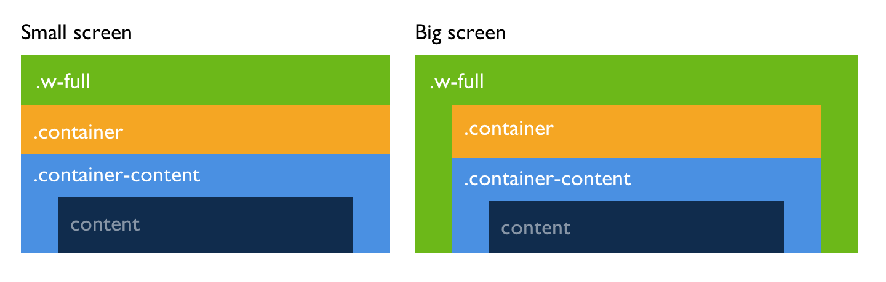

# 🐻 Karhu B2B
This project is based on the shopify-starter, documentation on the core can be found [here](https://github.com/askphill/shopify-starter/tree/0300514ff5e4df94f5a1d4aab0b808c471835c85#readme).

## Getting started
### Tools
- [VS Code](https://code.visualstudio.com/)
- [Shopify CLI](https://shopify.dev/themes/tools/cli/installation)

### Setup
1. Clone the repository 
1. Install recommended VS Code extensions (`CMD + SHIFT + P` → Show recommended extensions)
1. Install dependencies `npm i`
1. Start development server `npm run dev`
1. Happy developing ✨

## Sizing elements

### Containers
As certain elements grow based on aspect ratio and we want to limit the size it can grow to for larger screens, we set a max width. There are a few containers we use for this:

- `.w-full`: full width for background colors and sticky elements like the header
- `.container`: max width for visual elements
- `.container-content`: max width and horizontal padding for content, see `tailwind.containers.js` for variations

The container paddings are responsive values based on css variables, you can use the associated Tailwind spacings for absolute positioned elements (see `tailwind.config.js` → `theme.extend.spacings`).

